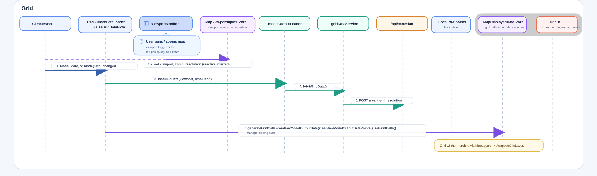

# Data Flow

## Introduction
The data flow branches based on whether the displayed data is displaying Regions or Grid cells.

### Input Query data

- The selected model
- Parameters for filtering the displayed data (usually universal for now): date/time
- Map mode specific parameters (Viewport bounds/position for Grid).

### Output rendering data

Output state is processed through a main service chain which tries to stay universal, except when the specific map data type(and mode) needs specific functions

Separate for each map mode are:

- API calls and handling of API responses
- Processing/combining logic for the data which is mode specific (e.g. merging NUTS GeoJSON Region definitions with NUTS actual ID:Intensity values)
- Mode-specific output stores that builds several Leaflet Component Mapping Layers, which get rendered when they have data.

Common for all map modes are:
- A controlling useClimateDataLoader main hook, which manages loading state
- A setter to set the data extremes for display in the legend
- Skeleton functions so the same process/API is followed in both modes, e.g. modelOutputLoader actually contains the two mode specific loader functions.


## Example full service chain for Grid Data
```text
ClimateMap.tsx -> useClimateDataLoader* -> useGridDataFlow -> modelOutputLoader.loadGridData(...) -> gridDataService.fetchGridData(...) -> /api/cartesian -> local raw model output points + local legend extremes -> GridProcessingStore.generateGridCellsFromTemperatureData(...) -> MapDisplayedDataStore.setGridCells(...) -> AdaptiveGridLayer.tsx
```



## Example full service chain for NUTS(Europe)
```text
ClimateMap.tsx -> useClimateDataLoader -> useEuropeNutsFlow -> modelOutputLoader.loadEuropeNutsData(...) -> nutsDataService.fetchNutsData(...) -> /api/nuts_data -> RegionProcessor.processEuropeOnlyRegionsFromApi(...) -> MapDisplayedDataStore.setProcessedEuropeNutsRegions(...) + local legend extremes -> MapLayers.tsx
```


## Output side changes specified in detail
The specific `Grid` or `NUTS` `ClimateQuery` deliberately changes only:

- (A) The type of requests made - `NUTS` needs region GeoJSON data + `/nuts` API actual data request; `Grid` needs raw data points with derived values from the viewport (`resolution`, `bounds`), then processes them into visual grids on the frontend.
- (B) The map layer components that get rendered. Both types render a Leaflet map (via `ClimateMap`); `Grid` mode renders `AdaptiveGridLayer`, and `NUTS` renders `MapLayers` with GeoJSON-based region output.

And also output these non-map outputs:

- (1) The Legend props, mainly the data min/max extremes derived from the raw data of either type in one flow that always updates in tandem with the map
- (2) Global Loading state + Status modals (errors on loading/missing data for year)
- (3) Meta information from the ClimateQuery for detailing on Screenshots

## Choice of Global/Map mode specific stores and hooks.
The current split is between small shared query/output state and mode-specific processing state.

### Shared query input: `ClimateQueryInput`
`useClimateDataLoader` builds one query object from `UserSelectionsForClimateQueryStore`: `mapMode`, `currentYear`, `currentMonth`, and `selectedModel`. It also builds a `climateQueryInputKey`, which is used to clear stale processing errors when the query changes.

### Shared output state
Shared output state stays simple: `setProcessedDataExtremes(...)` drives the legend, `loadingStore` + `mapDisplayedDataStore.isLoadingRawData` drive the common loading UI, and `useMapScreenshot` reads `selectedModel`, `currentYear`, `currentMonth`, and `selectedOptimism` from the same higher-level state.

### Mode-specific state
Mode-specific processing stays in the mode hooks. `Grid` uses `MapViewportInputsStore` (`mapViewportBounds`, `mapZoomLevel`, `dataResolution`), keeps raw points local inside `useGridDataFlow`, and writes final `gridCells` to `MapDisplayedDataStore`. `NUTS(Europe)` uses `useEuropeNutsFlow` and writes `processedEuropeNutsRegions`, with a separate `isProcessingEuropeNutsData` flag during the GeoJSON merge step.

## Extensibility
This split is still extensible. New shared query inputs usually belong in `ClimateQueryInput`; mode-only inputs belong next to that mode's processing, like the Grid viewport state. The screenshot hook already receives one extra UI field, `selectedOptimism`, without needing to know about the rendered layer data.

### Another map mode
Should mainly be another hook inside `useClimateDataLoader`, plus a matching rendered layer output in `MapDisplayedDataStore`.

### User selecting model variables
Should stay a fairly local query/UI change, then flow through the existing loader path.

### A complete full-flow integration test
Should be able to swap model metadata and then exercise the same `query -> load -> process -> render` path.

## Example service-chain flow for Data
### NUTS
```text
ClimateMap.tsx -> useClimateDataLoader -> useEuropeNutsFlow -> modelOutputLoader.loadEuropeNutsData(...) -> nutsDataService.fetchNutsData(...) -> /api/nuts_data -> RegionProcessor.processEuropeOnlyRegionsFromApi(...) -> MapDisplayedDataStore.setProcessedEuropeNutsRegions(...) + local legend extremes -> MapLayers.tsx
```

#### Sample working request URL
`http://localhost:5173/api/nuts_data?requested_time_point=2025-07-01&requested_variable_type=R0&requested_grid_resolution=NUTS3`

Notice "R0" has a capitalized R0, and this works this way for now because of a workaround in the backend...
Because of this line in heiplanet_db:
```text
var_name = (
"R0" if requested_variable_type == "r0_estimate" else requested_variable_type
)
```

even though r0_estimate is defined in the yaml file.

### Grid
```text
ClimateMap.tsx -> useClimateDataLoader -> useGridDataFlow -> modelOutputLoader.loadGridData(...) -> gridDataService.fetchGridData(...) -> /api/cartesian -> local raw model output points + local legend extremes -> GridProcessingStore.generateGridCellsFromTemperatureData(...) -> MapDisplayedDataStore.setGridCells(...) -> AdaptiveGridLayer.tsx
```

### Service-chain flow for screenshot data to rendering with imaginary future Gridmode specific attribute in image
```text
ClimateMap.tsx -> build read-only ScreenshotOverlayData from current query state (selected model / date / optimism) + future Grid-only display attribute (for example current grid resolution)
-> useMapScreenshot(...) -> leaflet-simple-map-screenshoter.takeScreen("blob") -> canvas.drawImage(...) -> canvas.fillText(...) with shared query metadata +
future Grid-only overlay text -> browser download of final PNG
```
