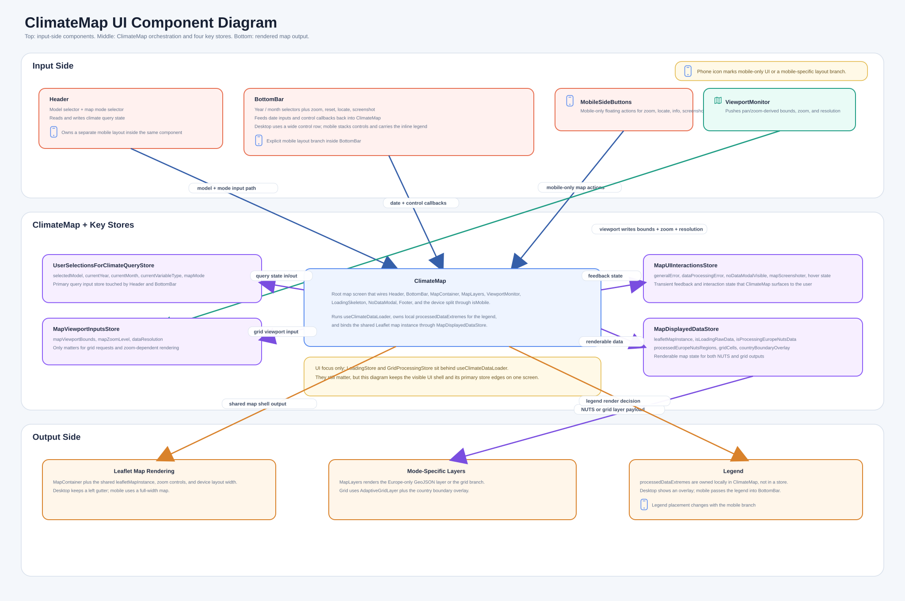
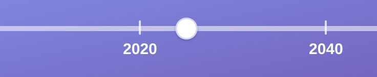
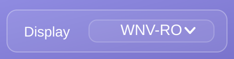

# UI Components

Simple current-state UI view of the map shell, its key input components, and the four stores that most directly shape rendering.

**Input components**

These inputs all converge on `UserSelectionsForClimateQueryStore`, which is the root query-state store read by `useClimateDataLoader` for `selectedModel`, `currentYear`, `currentMonth`, and `mapMode`.

## BottomBar

Input-side responsibility in `BottomBar`: date selection.

### DateSelector -> Year

Lives in `BottomBar`.

Draggable along the bottom on desktop, adjustable by previous and next year buttons on wide desktop, or by a mobile `Select`.

Relevant props: `year`, `onYearChange`.

Root data source: `UserSelectionsForClimateQueryStore.currentYear`.

Read path: `ClimateMap -> BottomBar.year={userStore.currentYear}`.

Write path: `BottomBar.onYearChange -> userStore.setCurrentYear`.

Transient UI state: `dragPreviewYear`, `isDragging`, and `magnifyPosition` only exist inside `BottomBar` to support the drag preview and magnifier; they do not persist into the store until release.

### DateSelector -> Month

Lives in `BottomBar`.

By select or buttons.

Relevant props: `month`, `onMonthChange`.

Root data source: `UserSelectionsForClimateQueryStore.currentMonth`.

Read path: `ClimateMap -> BottomBar.month={userStore.currentMonth}`.

Write path: `BottomBar.onMonthChange -> userStore.setCurrentMonth`.

Coupled behavior: month stepping can also call `onYearChange` when crossing January or December, so the month control can indirectly update both `currentMonth` and `currentYear`.

## Header

Input-side responsibility in `Header`: model selection and map-mode selection.

### Logo + Model

Lives in `Header`.

Logo plus model, with the model selected in a popup modal.

Container props: `models`, `modelMetadataLoading`, `modelMetadataError`.

Static asset: the logo is rendered from `/images/hei-planet-logo.png`; it does not persist data into a store.

Relevant props: `selectedModel`, `onModelSelect`, `models`, `loading`, `error`.

Root data source: `UserSelectionsForClimateQueryStore.selectedModel`.

Read path: `Header -> ModelSelector.selectedModel={userStore.selectedModel}`.

Write path: `Header.handleModelSelect -> userStore.setSelectedModel(modelId)`.

Lookup source: `ModelSelector` resolves the selected label from `models.find((m) => m.id === selectedModel)` and opens `ModelDetailsModal` for the popup flow.

### Map Mode

Lives in `Header`.

By select.

Relevant props: `value`, `onChange`.

Root data source: `UserSelectionsForClimateQueryStore.mapMode`.

Read path: `Header -> Select.value={userStore.mapMode}`.

Write path: `Header -> Select.onChange -> userStore.setMapMode`.

Allowed values: `"europe-only"` and `"grid"`.

**Todo**

Legend lives inside `BottomBar`, because on mobile, the legend goes horizontally along the bottom. But, conceptually, it lays completely separate as an output from the other components in `BottomBar` (which are inputs).
