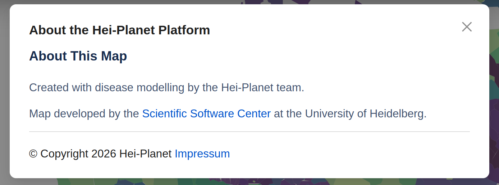
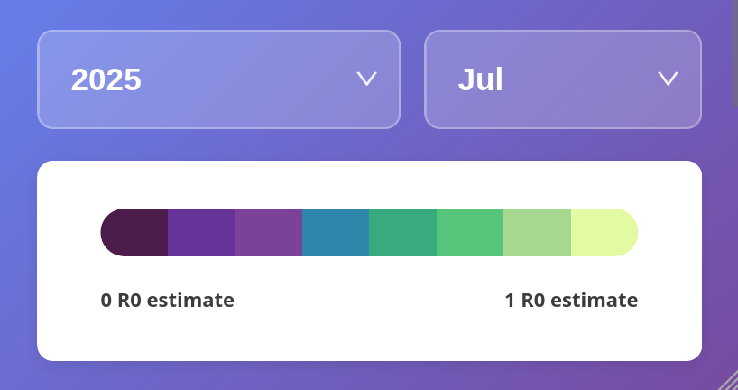
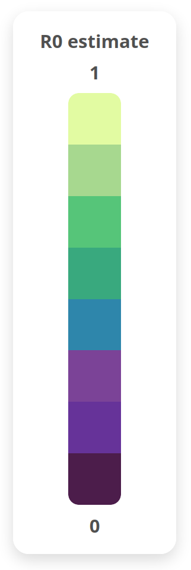

# UI Components

Simple current-state UI view of the map shell, its key input components, and the four stores that most directly shape rendering.

**Input components**

These inputs all converge on `UserSelectionsForClimateQueryStore`, which is the root query-state store read by `useClimateDataLoader` for `selectedModel`, `currentYear`, `currentMonth`, and `mapMode`.

## BottomBar

Input-side responsibility in `BottomBar`: date selection on both layouts, desktop map controls, and desktop action buttons. On mobile it also hosts the condensed year/month row plus the inline legend wrapper.

### DateSelector -> Year

Lives in `BottomBar`.

Draggable along the bottom on desktop, adjustable by previous and next year buttons on wide desktop, or by a mobile `Select`.

Relevant props: `year`, `onYearChange`.

Root data source: `UserSelectionsForClimateQueryStore.currentYear`.

Read path: `ClimateMap -> BottomBar.year={userStore.currentYear}`.

Write path: `BottomBar.onYearChange -> userStore.setCurrentYear`.

Transient UI state: `dragPreviewYear`, `isDragging`, and `magnifyPosition` only exist inside `BottomBar` to support the drag preview and magnifier; they do not persist into the store until release.

### DateSelector -> Month

Lives in `BottomBar`.

By select or buttons.

Relevant props: `month`, `onMonthChange`.

Root data source: `UserSelectionsForClimateQueryStore.currentMonth`.

Read path: `ClimateMap -> BottomBar.month={userStore.currentMonth}`.

Write path: `BottomBar.onMonthChange -> userStore.setCurrentMonth`.

Coupled behavior: month stepping can also call `onYearChange` when crossing January or December, so the month control can indirectly update both `currentMonth` and `currentYear`.

### Map View Controls

Lives in `BottomBar` desktop left control group.

These are the circular viewport controls for zoom in, zoom out, reset zoom, and find location.

Relevant props: `onZoomIn`, `onZoomOut`, `onResetZoom`, `onLocationFind`.

Read path: `ClimateMap -> useMapControls(mapDisplayedDataStore.leafletMapInstance) -> BottomBar`.

Write path:

- `BottomBar.onZoomIn -> useMapControls.handleZoomIn -> leafletMap.zoomIn()`
- `BottomBar.onZoomOut -> useMapControls.handleZoomOut -> leafletMap.zoomOut()`
- `BottomBar.onResetZoom -> useMapControls.handleResetZoom -> leafletMap.setView([10, 12], 3)`
- `BottomBar.onLocationFind -> useMapControls.handleLocationFind -> navigator.geolocation.getCurrentPosition(...) -> leafletMap.setView([lat, lng], 7)`

Persistence note: these do not directly write into a MobX store. They mutate the live Leaflet view, and `ViewportMonitor` is what later pushes viewport-derived bounds, zoom, and resolution back into map state.

### Action Buttons

Lives in `BottomBar` desktop right control group.

These are the wide `Screenshot`, `Model Info`, and `About` buttons.

Relevant props: `onScreenshot`, `screenshoter`, `models`, `selectedModelId`, `onModelSelect`.

Read path:

- `ClimateMap -> useMapScreenshot(...) -> BottomBar.onScreenshot`
- `ClimateMap -> models + userStore.selectedModel -> BottomBar -> ModelDetailsModal`

Write path:

- `Screenshot -> onScreenshot -> useMapScreenshot.handleScreenshot`
- `Model Info -> BottomBar.handleModelInfo -> isModelInfoOpen -> ModelDetailsModal`
- `About -> BottomBar.handleAbout -> isAboutOpen -> Modal -> AboutContent`

Modal ownership: `BottomBar` owns the open/close state for the two desktop modals, but the actual about copy is shared from `frontend/src/static/Footer.tsx` via the exported `AboutContent`.

### About Modal

The desktop `About` button in `BottomBar` opens an antd `Modal`, while the modal body comes from the shared `AboutContent` export in `frontend/src/static/Footer.tsx`.

Relevant state: `isAboutOpen`.

Open path: `BottomBar.handleAbout -> setIsAboutOpen(true) -> Modal open={isAboutOpen}`.

Content path: `BottomBar -> Modal -> AboutContent`.

Shared behavior note: `MobileSideButtons` reuses the same `AboutContent`, but with its own local `showInfo` modal state.

### Mobile Condensed Bottom Bar

Lives in the mobile branch of `BottomBar`.

This is the compact mobile block with the year select, month select, and the white card that wraps the horizontal legend.

Relevant props: `year`, `month`, `onYearChange`, `onMonthChange`, `legend`.

Read path: `ClimateMap -> BottomBar.year/month/legend`.

Write path:

- `Year Select.onChange -> userStore.setCurrentYear`
- `Month Select.onChange -> userStore.setCurrentMonth`
- `legend` is read-only here; `BottomBar` only places it inside the white container

Composition note: the mobile legend is created in `ClimateMap` and passed down as `BottomBar.legend`. `BottomBar` does not calculate the legend values itself.

## Header

Input-side responsibility in `Header`: model selection and map-mode selection.

### Logo + Model

Lives in `Header`.

Logo plus model, with the model selected in a popup modal.

Container props: `models`, `modelMetadataLoading`, `modelMetadataError`.

Static asset: the logo is rendered from `/images/hei-planet-logo.png`; it does not persist data into a store.

Relevant props: `selectedModel`, `onModelSelect`, `models`, `loading`, `error`.

Root data source: `UserSelectionsForClimateQueryStore.selectedModel`.

Read path: `Header -> ModelSelector.selectedModel={userStore.selectedModel}`.

Write path: `Header.handleModelSelect -> userStore.setSelectedModel(modelId)`.

Lookup source: `ModelSelector` resolves the selected label from `models.find((m) => m.id === selectedModel)` and opens `ModelDetailsModal` for the popup flow.

### Map Mode

Lives in `Header`.

By select.

Relevant props: `value`, `onChange`.

Root data source: `UserSelectionsForClimateQueryStore.mapMode`.

Read path: `Header -> Select.value={userStore.mapMode}`.

Write path: `Header -> Select.onChange -> userStore.setMapMode`.

Allowed values: `"europe-only"` and `"grid"`.

## MobileSideButtons

Input-side responsibility in `MobileSideButtons`: mobile-only floating map actions and modal launchers.

Lives in `frontend/src/component/Mapper/InterfaceInputs/MobileSideButtons.tsx`.

Buttons: zoom in, zoom out, find location, screenshot, about, model info, and minimize.

Relevant props: `map`, `modelMetadataLoading`, `models`, `selectedModel`, `onModelSelect`.

Read path:

- `ClimateMap -> mapDisplayedDataStore.leafletMapInstance -> MobileSideButtons.map`
- `ClimateMap -> models + userStore.selectedModel -> MobileSideButtons`

Write path:

- `handleZoomIn/handleZoomOut -> leaflet map instance`
- `handleLocationRequest -> navigator.geolocation.getCurrentPosition(...) -> map.flyTo(...)`
- `handleSaveScreenshot -> screenshoter.takeScreen("blob") -> browser download`
- `Info button -> showInfo -> Modal -> AboutContent`
- `FileText button -> showModelDetails -> ModelDetailsModal`

About-content note: mobile and desktop reuse the same `AboutContent` export from `frontend/src/static/Footer.tsx`; only the modal shell and local open state differ.

## Legend

Output-side responsibility in `Legend`: show the processed data extremes and the dynamic variable label for the current map output.

Lives in `frontend/src/component/Mapper/utilities/mapDataUtils.tsx`.

Root data source: local `processedDataExtremes` state in `ClimateMap`.

Read path:

- `useClimateDataLoader(... setProcessedDataExtremes)`
- `ClimateMap -> processedDataExtremes`
- `ClimateMap -> Legend extremes={processedDataExtremes} unit={getVariableUnit(userStore.currentVariableType)}`
- `Legend -> getVariableDisplayName(unit)`

Desktop ownership: `ClimateMap` renders the desktop legend separately from `BottomBar`, as an overlay positioned beside the map.

Mobile ownership: `ClimateMap` creates `mobileLegend` and passes it into `BottomBar.legend`; `BottomBar` only wraps it in the white mobile card.

Boundary note: even though the mobile legend is visually inside `BottomBar`, it is conceptually an output component, not an input control.

