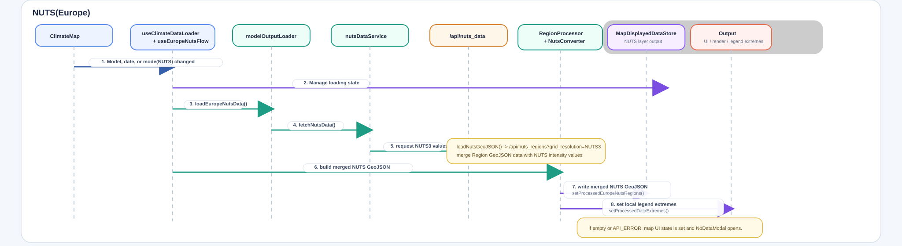
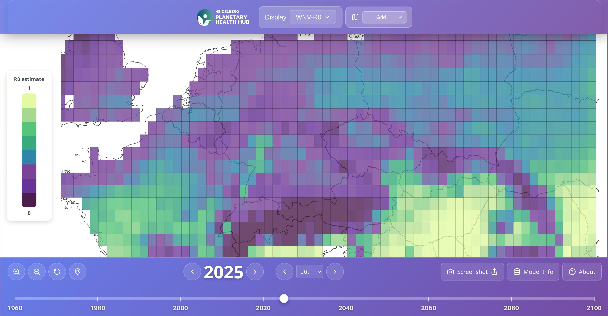
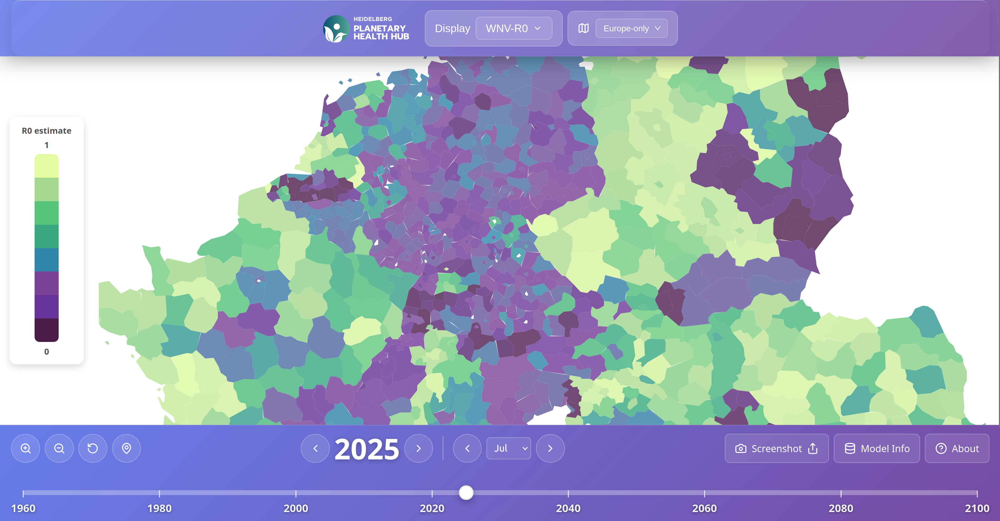

# heiplanet Frontend Mapping application

## Description
The heiplanet Mapping project shows the predictions and predicted susceptibility in the future of different diseases by Infectious disease/Climate models from the group, across different regions in the map.

This repository contains the frontend for the Climate Map. The user can browse for models with the Model Selector, and change the year to see future suspcetibility predictions.

It can be configured to request and display NUTS3 regions, or worldwide equivalent regions, which is dependent upon the underlying model.

## Background context on the view types (technically specific)
For the worldwide view, the data is projected from individual points into polygons on the frontend.

## NUTS(Europe) Data loading full service chain

## Example: Worldwide Simple R0 example

## Example: NUTS version

## Data Flow
The data flow adjusts the shown map data based principally on the user's selected model and date. The user can also view the map in two modes, `europe-only` or `grid`, which changes the flow of data. You can read more [here](./DataFlow.md).

## Installation guide
- First, make sure the `onehealth-db` repository is running with the API accessible. It depends upon a running postgres database, typically docker name `my-postgres`. The API must be able to return generated data for 2016 and 2017.
- Run `pnpm i` to install dependencies.
- Run `pnpm run dev` to launch the application.

## Usage examples
The website can be used by visiting `http://localhost:5173/map`, which will present the user with two view modes.

You can also share the link directly to a specific view mode:
- Citizen: `http://localhost:5173/map/citizen`
- Expert: `http://localhost:5173/map/expert`

## Support, contributing and authors
Create an issue in the repository.

## License
MIT, see `LICENSE.md`.

## Project status
Under development.

No future roadmap items remain.
